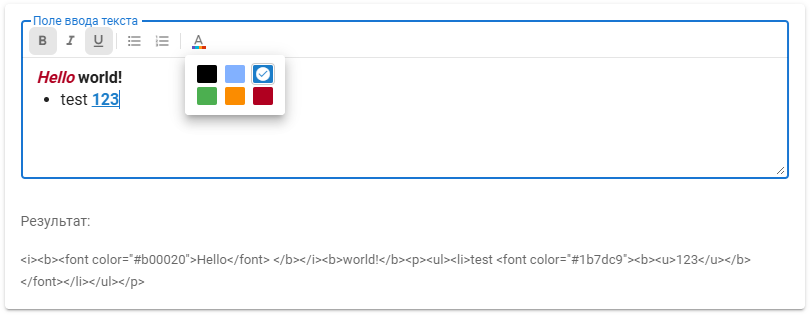

# Rich text editor for Vuetify 2
A minimalistic component without external dependencies and unnecessary styles

> [!WARNING]  
> This editor is based on the deprecated `document.execCommand` method

## Project setup
1. `npm install`
2. `npm run serve`

## How to use?
Just copy-paste `components/RichTextEditor.vue` component to your project
